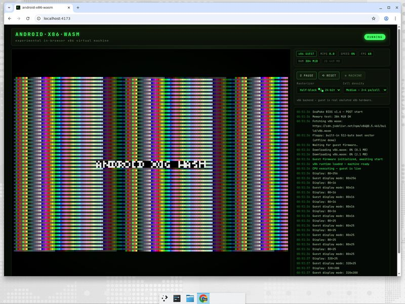

# android-x86-wasm

**Experimental in-browser Android x86 virtual machine.** An x86 PC emulator
([v86](https://github.com/copy/v86), compiled to WebAssembly) boots a guest
image in your browser while a custom rasterizer turns the guest VGA
framebuffer into a high-density **Unicode half-block terminal** — `▀`/`▄`
cells with 24-bit colors — plus a retro BIOS boot log, live performance HUD,
and pointer/touch input translation. Deploys to Vercel as a static site.

> **Status: working prototype.** No Android image is bundled, but a real
> v86 boot path works out of the box: the **Built-in boot sector** option
> loads a hand-assembled 512-byte floppy guest on the emulated machine
> (mode-13h graphics, zero image downloads). The default **demo
> framebuffer** mode is clearly labelled and exercises the full
> rasterizer/HUD/input pipeline. Point MACHINE at an image URL
> (Android-x86 ISO, raw disk image, or Linux bzImage) to boot real
> software.

## Quick start

```sh
npm install
npm run dev        # http://localhost:5173
```

Press **START** — the demo framebuffer animates immediately. To boot real
emulated hardware with zero downloads, open **⚙ MACHINE**, choose
**Built-in boot sector (offline)**, and hit **APPLY & POWER ON**: SeaBIOS
POSTs, loads the bundled 512-byte floppy guest, and it paints a mode-13h
test screen — all live on the real v86 core. To boot a full guest OS,
pick an image type + URL (or a suggestion chip) and apply.



## Architecture

```
┌──────────────────────────────────────────────────────────────┐
│ React UI (Vite + TS)                                         │
│  TerminalScreen ──► CanvasCellRenderer ──► Unicode cell grid │
│  BootLog · Hud · Controls · PointerTranslator                │
├──────────────────── EmulatorAdapter (interface) ─────────────┤
│  V86Adapter                 │  DemoAdapter                   │
│  copy/v86 WASM emulator     │  deterministic synthetic frame │
│  hidden screen canvas tap   │  (always available)            │
└──────────────────────────────────────────────────────────────┘
```

- **`src/emulator/`** — `types.ts` defines the `EmulatorAdapter` contract
  (frame capture, pointer, stats, lifecycle events). `v86Adapter.ts` wraps
  `new V86(...)`: the emulator's own screen canvas is hosted in a hidden
  offscreen container with `use_graphical_text`, so **both text and graphics
  guest modes land on one canvas** and a single `getImageData` tap covers
  SeaBIOS output and Android's framebuffer alike. `demoAdapter.ts`
  synthesizes a deterministic animated 320×200 RGBA frame.
- **`src/raster/`** — pure, unit-tested raster pipeline:
  - `rasterizer.ts` — framebuffer → `CellGrid`. Half-block mode packs two
    vertically stacked pixel regions per cell (`▀`, fg = top, bg = bottom);
    ASCII mode maps average luminance onto the `@%#*+=-:.` ramp.
  - `grid.ts` — guest-pixel ↔ cell ↔ DOM coordinate math (used for both
    rendering and pointer translation, tested for round-trips).
  - `canvasRenderer.ts` — two-pass renderer (background fillRect runs, then
    foreground glyph runs; block glyphs drawn as rects — visually identical
    to the Unicode semantics, immune to font metrics). `gridToAnsi()`
    serializes any grid to real 24-bit ANSI text.
- **`src/input/pointer.ts`** — Pointer Events on the terminal canvas → cell
  → guest pixel → adapter. For v86 this re-dispatches synthetic mouse events
  onto v86's screen container so v86's own PS/2/absolute-tablet translation
  applies.
- **`src/ui/`** — React shell: retro boot log, HUD (MIPS / speed % / FPS /
  RAM), machine controls, scanline/CRT styling.

## Guest images & licensing

**No disk images or BIOS binaries are committed to this repository.** At
runtime everything is fetched over HTTPS from CORS-enabled CDNs:

| Artifact | Default source | License |
|---|---|---|
| `v86.wasm`, `libv86` | `v86` npm package / jsDelivr | BSD-2-Clause |
| `seabios.bin`, `vgabios.bin` | jsDelivr (`copy/v86` git tree) | LGPLv3 (SeaBIOS) |
| built-in boot sector | generated in-app (`src/guest/bootsector.ts`) | MIT (this repo) |
| guest OS image | **you configure it** | varies |

- **Built-in boot sector** — a 512-byte floppy image assembled in code:
  switches to VGA mode 13h, fills the framebuffer with a palette pattern,
  prints `ANDROID-X86-WASM`, and halts. It needs no downloads beyond the
  wasm/BIOS, so it verifies the whole v86 → framebuffer → rasterizer path
  even offline of any image host.
- The suggestion chips point at **Android-x86** release ISOs on OSDN
  (1.6 Donut, 2.2 Froyo) — marked `· needs CORS` because whether they load
  depends on the mirror honoring cross-origin requests at that moment.
  Older Android-x86 releases (1.6–4.0) are the practical sweet spot for
  in-browser emulation; Android 4.x+ is possible but slow.
- **CORS is required**: the image host must send
  `Access-Control-Allow-Origin`. If it doesn't, downloads fail — either pick
  a CORS-enabled mirror, self-host the image in `public/images/` (gitignored),
  or serve it next to the app.
- Enable **"Stream via HTTP Range"** for large images: v86 then fetches the
  image lazily in chunks (needs `Accept-Ranges` + `Content-Length` support —
  detected automatically via a HEAD request, with fallback to full
  download). This is the chunked-fetch path for big ISOs.
- Android-x86 images contain GPL components; their distribution terms belong
  to their publishers. This project only *links* to user-supplied URLs.

Want fully self-hosted v86 artifacts (offline/CSP-strict)? Run
`npm run sync:v86` to copy `v86.wasm` from the npm package into
`public/v86/`, then set the wasm URL to `/v86/v86.wasm` in MACHINE settings.

## Controls

| Control | Effect |
|---|---|
| **▶ START / ⏸ PAUSE** | Resume / suspend emulation |
| **⟲ RESET** | Hard power-cycle the machine |
| **Rasterizer** | `Half-block ▀/▄ 24-bit` or `ASCII luminance` |
| **Cell density** | Guest pixels per cell (High 1×2 / Medium 2×4 / Low 4×8) — lower density = faster |
| **⚙ MACHINE** | Guest image type + URL, initrd/cmdline, Range streaming, RAM (256–512 MiB), wasm/BIOS URLs |
| **Pointer** | Click/drag on the terminal grid — translated to guest screen coordinates and dispatched to the emulated mouse/digitizer |

The **HUD** shows emulated MIPS, speed relative to a nominal Pentium-era
target, rasterizer FPS, configured guest RAM, and JS heap (where available).
The backend chip always says **v86 GUEST** or **DEMO FRAMEBUFFER** — the app
never claims a guest OS is running when the demo is active.

## Development

```sh
npm run lint        # eslint (flat config)
npm run typecheck   # tsc --noEmit (app + config projects)
npm run test        # vitest — rasterizer, colors, coordinate math
npm run build       # production build → dist/
npm run preview     # serve dist/ locally
```

CI (`.github/workflows/ci.yml`) runs lint → typecheck → tests → build on
every push/PR.

## Deploying to Vercel

`vercel.json` at the repo root configures a zero-config Vite deploy:

```json
{ "framework": "vite", "outputDirectory": "dist" }
```

Import the repo in Vercel (root directory) — no further settings needed.
All runtime artifacts (wasm, BIOS, guest images) are loaded cross-origin
from CDNs, so nothing large has to be deployed. If you self-host images
under `public/images/` they deploy with the site automatically.

## Performance notes

- **Raster cost scales with cell count.** At 800×600, "Medium" density
  yields a 400×150 grid (60k cells) — fine on desktop; "Low" is recommended
  for large guest resolutions or weak hardware.
- `captureFrame()` does a GPU→CPU readback (`getImageData`) per rendered
  frame — the main throughput limit. The renderer batches same-color runs
  to keep draw calls low.
- Range streaming avoids multi-hundred-MB up-front ISO downloads at the cost
  of per-read latency; good for live CDs, unnecessary for small images.
- v86's wasm JIT warms up over the first seconds of execution — MIPS in the
  HUD ramps as hot code paths get compiled.

## Troubleshooting

- **"Download failed" in the boot log** — the image host lacks CORS headers,
  or the URL 404s. Check the browser console for the failing request; try a
  suggested image or self-host.
- **Black screen after SeaBIOS** — no bootable media. Pick `CD-ROM` kind
  with a bootable ISO, or `linux` with a bzImage.
- **Mouse doesn't move in the guest** — the guest must enable the PS/2
  mouse/tablet; click into the screen once. Android-x86 enables absolute
  pointer automatically.
- **Slow** — drop cell density to Low, use ASCII mode, or a smaller/faster
  guest image. Browsers also throttle background tabs.
- **`use_graphical_text` rendering glitches** — set the rasterizer to
  ASCII; text-mode guests render most accurately there.

## License

MIT for this repository's code. v86 is BSD-2-Clause (© its contributors);
SeaBIOS/VGA BIOS are LGPLv3 — all loaded at runtime, not vendored. Guest OS
images are subject to their own licenses and are never redistributed here.
